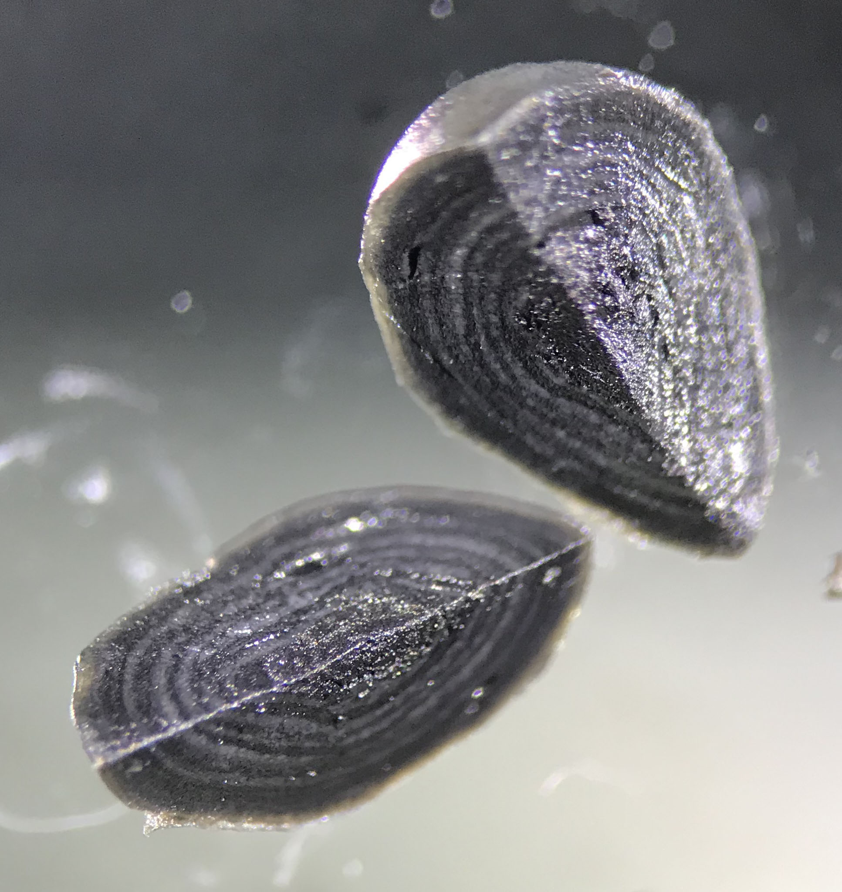

# metagenome_analysis

##  Metagenome analysis - defining functional guilds

#### Samuel J. Bryson

### Analysis of metagenomes derived from three individual granular biofilms that posessed a layered structure (*like an onion*) consisting of a dark core and alternating light and dark layers. 

### Granule features:

- Background and first description in:

  Pelivano, Bojan, Samuel Bryson, Kristopher A. Hunt, Martin Denecke, David A. Stahl, and Mari Winkler. 2022. “Application of Pyritic Sludge with an Anaerobic Granule Consortium for Nitrate Removal in Low Carbon Systems.” Water Research 209 (February): 117933.

- Originally obtained from an anaerobic digestor treating dairy processing wastewater.
- Maintained under anoxic conditions in a lab scale fluidized bed reator with no carbon source supplied in the media, but nitrate and sulfate were supplied in the influent media.
- Charaterization of the granules included SEM-EDX analysis that revealed the presence of iron sulfur (FeS) and pyrite (FeS2) and short term incubations (*i.e. batch tests*) that examined hydrolysis of organic carbon (*acetate production*), methanogenesis (CH4 production) plus nitrate (NO3-) and sulfate (SO42-) reduction.
 
### This Jupyter Notebook presents bioinformatics analysis performed in order to:

**Characterize the microbial community structure.**

- Who's there? What's their relative abundance?
 
**Identify functional guilds within the assemblage.**

- Which taxa perform what ecological functions?
- Can individual taxa be grouped together into clusters that perform similar functions?

**Compare the identified taxa and their associated functions across different environments.**

- Are individual taxa (*metagenome assembled genomes or MAGs*) found in other similar or different environments, e.g. other anaerobic digesters, cattle rumens, wetland soil, or groundwater?
- What does detecion accross different environments rebeal about environmental filtering and the selective pressures imposed on different funtional genes?
